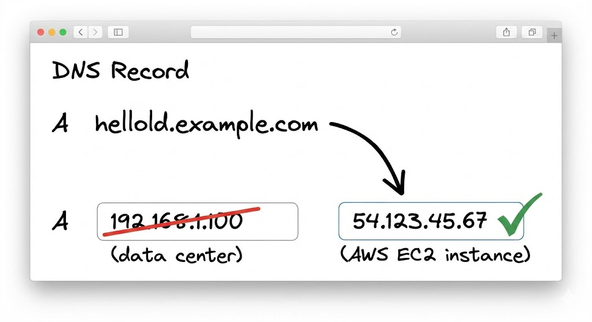
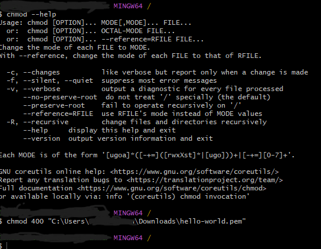

<<<<<<<<<<<<<< Proof of Concept <<<<<<<<<<<<<<

This methodology outlines the steps to migrate a simple "Hello World" application from an on-premises data center (or your local machine) to Amazon Web Services (AWS), including the final DNS cutover.

1. Assess the Current Environment
The first step is to understand the existing setup. This involves identifying the server hosting the application, its operating system, any dependencies, and its current IP address. For our "Hello World" app, this is a single isolated server in a rack, not accessible to the internet, or other servers. 

The image above shows the starting point: a physical server in a data center running the "Hello World" application.

2. Set Up the AWS Environment and Deploy
Next, we'll provision the necessary resources in AWS with Terraform. 
We will not use default VPC, we will provison a VPC and a private subnet to host our server. We will launch an Amazon EC2 instance with a similar operating system to the on-premises server, in the case (demo) a free tier EC2 will suffice. 

>> Once the instance is running, you can transfer (via SSH) your "Hello World" application code to it and start the application. 
This would be a **RE-HOST** example of the 7 R's of migration. We are simply taking the same python file(s) and transfering it to the AWS EC2 server. 
Once we confirm that the app is up in the cloud, we have the option of shutting down the on-premises server.  

>> Add screenshot of the AWS Management Console shows the "Hello World" application being deployed to a new EC2 instance. The application is now running in the cloud, but users are still being directed to the old data center.

1. Cut Over DNS - NOT IN REPO OR CODE -
The final and most critical step is to update your DNS records to point to the new AWS instance. This is done by changing the 'A' record for your domain (e.g., helloworld.example.com) from the old data center's IP address to the new Elastic IP address of your EC2 instance. Once this change propagates, all new traffic will be directed to the application running on AWS.

The diagram above illustrates the DNS cutover, where the old data center IP is replaced with the new AWS EC2 IP address.

Following these three steps completes the migration of your "Hello World" application from an on-premises data center to AWS. You can now decommission the old server.

Send the python app from the on-prem server to EC2 in steps
![alt text] 
